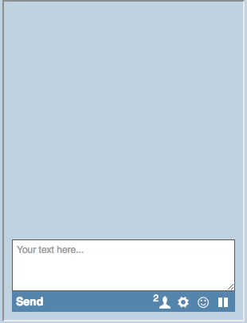

# Twaddle chat

### Features
* Chat rooms
* Online users in room
* Ignore messages unwelcome users
* Smiles :octocat:
* Settings
* Easy to use

### Demo


### Install
```
docker build -t twaddle-chat .
docker run --name redishost -d avezhenya/redis
docker run --name chat -p 8889:8889 --link redishost:redishost -d twaddle-chat
```

If you want automatic deploy you may use **docker-compose** and **makefile**.

### How to use


### Settings (config file)
- CACHE_SIZE - How much messages can be in room at the same time.
- ROOM_CLEAR_TIMEOUT - Maximum storage time for message.
- ROOM_REMOVE_TIMEOUT - Maximum storage time for room when it don't have
        clients.
- USER_BAN_LIST_TIMEOUT - Maximum storage time for user ban list.
- USERNAME_IGNORE_LIST - List of prohibited names.
- PATTERN_1 - pattern for bad words (Russian language)
- PATTERN_2 - pattern for bad words (Russian language)
- PATTERN_3 - pattern for replace all links from message

### Requirements
- Python >= 3.5.0

### License
Copyright © 2016 avezhenya

Distributed under the Eclipse Public License either version 1.0 or any later version.

### Authors

